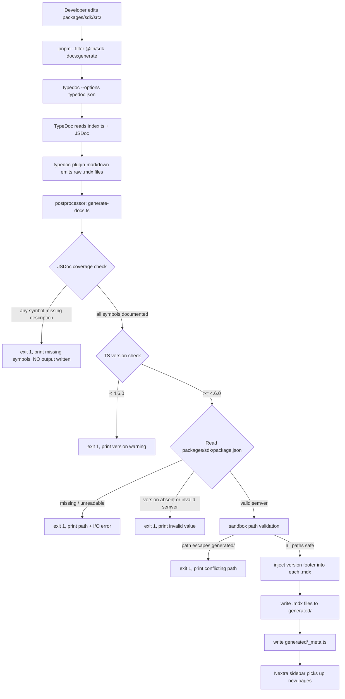
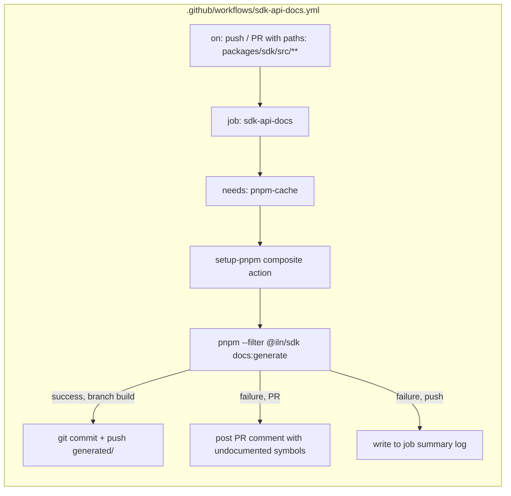

# Design Document: SDK API Reference Generation

## Overview

This feature adds an automated documentation pipeline that extracts JSDoc comments and TypeScript type information from the `@iln/sdk` package and publishes them as MDX pages inside the existing Nextra docs site. The pipeline has three main stages:

1. **TypeDoc** parses `packages/sdk/src/index.ts` and produces structured documentation data.
2. A **custom postprocessor script** (`packages/sdk/scripts/generate-docs.ts`) enforces JSDoc coverage, injects version footers, sandboxes output paths, generates `_meta.ts`, and validates pre-conditions (semver, TypeScript version).
3. A **GitHub Actions workflow** (`.github/workflows/sdk-api-docs.yml`) triggers the script on every SDK source change, commits the results back to the branch, and reports failures through PR comments or job summaries.

The design intentionally keeps TypeDoc as a "dumb converter" and delegates all domain-specific logic (coverage enforcement, footer injection, navigation generation) to the postprocessor, so TypeDoc upgrades don't accidentally break policy checks.

---

## Architecture





---

## Components and Interfaces

### 1. `packages/sdk/typedoc.json` — TypeDoc Configuration

A static JSON file that configures TypeDoc for the SDK. It has no runtime logic; it is consumed solely by the `typedoc` CLI.

```jsonc
{
  "entryPoints": ["src/index.ts"],
  "entryPointStrategy": "resolve",
  "excludePrivate": true,
  "excludeInternal": true,
  "out": "../../packages/docs/content/sdk-reference/generated",
  "plugin": ["typedoc-plugin-markdown"],
  "fileExtension": ".mdx",
  "hideBreadcrumbs": true,
  "hidePageHeader": false,
  "parametersFormat": "table",
  "propertiesFormat": "table",
  "enumMembersFormat": "table"
}
```

Key decisions:
- `entryPointStrategy: "resolve"` means only symbols reachable from `index.ts`'s public exports are documented. Internal files are invisible unless re-exported.
- `typedoc-plugin-markdown` is responsible for MDX file emission; TypeDoc itself only builds the reflection tree and JSON.
- `hideBreadcrumbs: true` prevents TypeDoc from generating relative breadcrumb links that would break Nextra's flat routing model.
- Table-format parameters/properties produce cleaner MDX than bullet lists and are less likely to trigger MDX 2 parsing issues.

---

### 2. `packages/sdk/scripts/generate-docs.ts` — Postprocessor Script

This is the core of the feature. It is invoked by the `docs:generate` npm script and wraps the TypeDoc invocation with all domain-specific enforcement. The script is written in TypeScript and executed via `tsx` (or `ts-node`) so it shares the same environment as the rest of the SDK toolchain.

**Script interface:**

```
Usage: tsx scripts/generate-docs.ts [--dry-run]

Environment:
  SDK_PACKAGE_JSON  override path to packages/sdk/package.json (default: auto-detected)

Exit codes:
  0  success, all output files written
  1  pre-condition failed; see stderr/stdout for details
```

**Processing steps (in order):**

1. **TypeScript version check** — Resolve the TypeScript version from the local `node_modules` (`typescript/package.json`). If `semver.lt(detectedVersion, "4.6.0")` is true, print to stderr and exit 1.
2. **Read SDK `package.json`** — Read and parse `packages/sdk/package.json`. Exit 1 with path + I/O error message on any failure.
3. **Validate semver** — Call `semver.valid(pkg.version)`. If null, exit 1 with the invalid value and expected format.
4. **Invoke TypeDoc programmatically** — Use the TypeDoc Application API (`Application.bootstrap`) with the parsed `typedoc.json` options to build the reflection tree in memory, without writing output yet.
5. **JSDoc coverage check** — Traverse all `DeclarationReflection` nodes in the project reflection. For each public symbol (Kind: Class, Method, Function, TypeAlias, Interface, Enum, Property), check that `reflection.comment?.summary` contains at least one `{kind: "text", text: ...}` part with at least one non-whitespace character. Collect all violations. If any violations exist, print each as `[MISSING JSDOC] SymbolName  path/to/file.ts:line` to stdout, then exit 1 without writing any files.
6. **Sandbox path validation** — Compute the resolved absolute path for every file TypeDoc would write. If any path does not start with the resolved absolute path of `packages/docs/content/sdk-reference/generated/`, print the conflicting path to stderr and exit 1.
7. **Write MDX files** — Trigger TypeDoc's renderer to write the `.mdx` files via `typedoc-plugin-markdown`.
8. **Version footer injection** — For each written `.mdx` file, append `\n\n---\n\nGenerated on ${utcDate} from SDK v${semver}\n` as the last content. The `utcDate` is `new Date().toISOString().slice(0, 10)` (always UTC `YYYY-MM-DD`).
9. **`_meta.ts` generation** — Scan `packages/docs/content/sdk-reference/generated/` for all `*.mdx` files (excluding `_meta.ts` itself). Build an object mapping each filename-without-extension to a human-readable label (title-cased, hyphen-to-space). Write `generated/_meta.ts` with `export default { ... }`.

**Key design decision — TypeDoc programmatic API vs CLI:**
Using the TypeDoc programmatic API (rather than spawning a child process) allows the postprocessor to inspect the reflection tree before rendering, enabling the coverage check to happen before any files are written to disk. If TypeDoc is invoked as a CLI subprocess, there is no clean way to intercept the reflection tree.

---

### 3. `packages/sdk/package.json` — npm Scripts

Two new scripts are added:

```json
{
  "scripts": {
    "docs:generate": "tsx scripts/generate-docs.ts",
    "docs:preview": "pnpm docs:generate && pnpm --filter @iln/docs dev"
  }
}
```

`docs:preview` uses `&&` so the dev server only starts if `docs:generate` exits 0, satisfying Requirement 7.4. The exit code of `docs:generate` is propagated naturally by the shell.

New devDependencies to add:
```json
{
  "devDependencies": {
    "typedoc": "0.27.x",
    "typedoc-plugin-markdown": "4.x",
    "tsx": "^4.0.0",
    "semver": "^7.6.0",
    "@types/semver": "^7.5.0"
  }
}
```

---

### 4. `packages/docs/content/sdk-reference/_meta.ts` — Top-Level Nav Config

The existing file must be updated to import the generated sub-meta and place hand-authored entries first:

```typescript
import generatedMeta from './generated/_meta'

export default {
  installation: 'Installation',
  'api-reference': 'API Reference',
  'error-handling': 'Error Handling',
  ...generatedMeta,
}
```

This satisfies Requirement 6.3: hand-authored keys always appear before generated keys. Nextra respects the key order in the exported object for sidebar ordering.

**Nextra guard for missing `generated/_meta.ts`:** Because `_meta.ts` imports `generated/_meta`, Next.js will fail the build with a module-not-found error if the generated file is absent, satisfying Requirement 6.5 without any extra code.

---

### 5. `.github/workflows/sdk-api-docs.yml` — CI Workflow

A standalone workflow file (not added inline to `ci.yml`) to keep concerns separated. It triggers on the same `push` / `pull_request` events as `ci.yml` but with a path filter scoped to SDK source files.

```yaml
name: SDK API Docs

on:
  push:
    paths:
      - 'packages/sdk/src/**'
  pull_request:
    paths:
      - 'packages/sdk/src/**'

permissions:
  contents: write
  pull-requests: write

jobs:
  pnpm-cache:
    uses: ./.github/workflows/reusable-cache-pnpm.yml

  sdk-api-docs:
    name: sdk-api-docs
    needs: [pnpm-cache]
    runs-on: ubuntu-latest
    steps:
      - uses: actions/checkout@v4
        with:
          # fetch full history so bot commit can push
          fetch-depth: 0

      - name: Setup pnpm with store cache
        uses: ./.github/actions/setup-pnpm

      - name: Generate SDK API docs
        id: generate
        run: pnpm --filter @iln/sdk docs:generate
        # stdout is captured for the failure comment step

      - name: Commit and push generated docs
        if: success() && github.event_name != 'pull_request'
        run: |
          git config user.name  "github-actions[bot]"
          git config user.email "github-actions[bot]@users.noreply.github.com"
          git add packages/docs/content/sdk-reference/generated/
          git diff --cached --quiet || git commit -m "chore(docs): regenerate SDK API reference [skip ci]"
          git push

      - name: Comment on PR with undocumented symbols
        if: failure() && github.event_name == 'pull_request'
        uses: actions/github-script@v7
        with:
          script: |
            const output = `${{ steps.generate.outputs.stdout }}`;
            github.rest.issues.createComment({
              issue_number: context.issue.number,
              owner: context.repo.owner,
              repo: context.repo.repo,
              body: `🚨 **SDK API docs generation failed!**\n\nUndocumented public symbols:\n\`\`\`\n${output}\n\`\`\``
            })

      - name: Write failure to job summary
        if: failure() && github.event_name != 'pull_request'
        run: |
          echo "## SDK Docs Generation Failed" >> $GITHUB_STEP_SUMMARY
          echo "Undocumented symbols detected. Run \`pnpm --filter @iln/sdk docs:generate\` locally." >> $GITHUB_STEP_SUMMARY
```

**Design decisions:**
- The workflow is separate from `ci.yml` so that existing CI jobs don't need restructuring and the path filter doesn't interfere with other jobs.
- `[skip ci]` in the bot commit message prevents an infinite loop where the bot's commit re-triggers the workflow.
- `fetch-depth: 0` is required so the push step can work on PR branches that were checked out shallowly.
- stdout capture from the `generate` step is used to echo the undocumented symbol list into the PR comment.

---

## Data Models

### TypeDoc Reflection Tree → MDX Category Files

TypeDoc produces a `ProjectReflection` tree. The postprocessor maps it to output files as follows:

| TypeDoc Kind | MDX filename |
|---|---|
| `ReflectionKind.Class` | `classes.mdx` |
| `ReflectionKind.Interface` | `interfaces.mdx` |
| `ReflectionKind.Enum` | `enumerations.mdx` |
| `ReflectionKind.TypeAlias` | `type-aliases.mdx` |
| `ReflectionKind.Function` | `functions.mdx` |

Categories with zero exported members are omitted entirely (no empty file is written).

### `_meta.ts` Shape

```typescript
// packages/docs/content/sdk-reference/generated/_meta.ts
export default {
  "classes": "Classes",
  "interfaces": "Interfaces",
  "enumerations": "Enumerations",
  "type-aliases": "Type Aliases",
  "functions": "Functions",
} satisfies Record<string, string>
```

The label is derived by replacing hyphens with spaces and title-casing each word.

### Version Footer

Every generated `.mdx` file ends with:

```markdown
---

Generated on 2025-07-14 from SDK v0.1.0
```

The `---` horizontal rule visually separates the footer from symbol documentation. The date is always the UTC calendar date of the generation run (`new Date().toISOString().slice(0, 10)`).

### Current SDK Public Symbols (from `packages/sdk/src/index.ts`)

Based on the current codebase:
- `InvoiceClient` (Class) — exports `submitInvoice`, `fundInvoice`, `markPaid`
- `ScVal` (TypeAlias, re-exported from `@stellar/stellar-sdk`)
- `xdr` (const / Function namespace)

All three currently lack JSDoc comments, so the first `docs:generate` run will exit 1 until JSDoc is added. This is intentional — the feature enforces documentation quality from day one.

---

## Correctness Properties

*A property is a characteristic or behavior that should hold true across all valid executions of a system — essentially, a formal statement about what the system should do. Properties serve as the bridge between human-readable specifications and machine-verifiable correctness guarantees.*

### Property 1: Category-to-file bijection

*For any* set of public symbol categories where at least one symbol exists in each category, the MDX generator SHALL produce exactly one output file per non-empty category — no extra files and no missing files.

**Validates: Requirements 2.1, 6.2**

### Property 2: All generated files are valid MDX 2

*For any* public symbol with any combination of valid JSDoc content (descriptions, `@param` tags, `@returns` tags, code examples) and any valid TypeScript type signature, the generated `.mdx` file SHALL compile without a parse error when processed by `@mdx-js/mdx`.

**Validates: Requirements 2.2**

### Property 3: Output path sandboxing

*For any* public symbol with any name (including names containing path traversal sequences such as `../` or `%2F`), every file path the generator resolves for output SHALL be contained within `packages/docs/content/sdk-reference/generated/`. Any path that escapes this boundary SHALL cause the generator to exit 1 before writing any file.

**Validates: Requirements 2.4**

### Property 4: _meta.ts completeness and key correspondence

*For any* set of generated MDX files with any filenames, the resulting `generated/_meta.ts` SHALL export a default object containing exactly one key per generated file (keyed by filename without extension), with no extra keys and no missing keys.

**Validates: Requirements 2.5, 6.2**

### Property 5: Version footer format and placement

*For any* valid UTC date and any valid semver string, every generated `.mdx` file SHALL have as its last non-empty line a string matching the pattern `Generated on YYYY-MM-DD from SDK v{semver}`, where the date components are the correct UTC calendar date components and `{semver}` is the version string read from `packages/sdk/package.json`.

**Validates: Requirements 3.1, 3.2**

### Property 6: Invalid semver terminates generation

*For any* string that does not satisfy `semver.valid()` — including `null`, empty string, plain integers, and malformed version strings — when that string appears as the `version` field in `packages/sdk/package.json`, the generator SHALL exit with a non-zero status code and an error message that includes the invalid value.

**Validates: Requirements 3.4**

### Property 7: JSDoc coverage enforcement with pre-write abort

*For any* collection of public symbols where at least one symbol lacks a qualifying JSDoc description (i.e., no comment or a comment whose text is entirely whitespace), the generator SHALL: (a) exit with a non-zero status code, (b) print to stdout the name and source location of every undocumented symbol (not just the first), and (c) write zero MDX output files — the `packages/docs/content/sdk-reference/generated/` directory SHALL remain unchanged.

**Validates: Requirements 4.1, 4.2, 4.3**

### Property 8: TypeScript version gate

*For any* TypeScript version string that is semver-less-than `4.6.0`, when that version is the resolved TypeScript version in the execution environment, the generator SHALL print a message to stderr stating both the detected version and the minimum required version (`4.6.0`), and SHALL exit with a non-zero status code.

**Validates: Requirements 7.3**

### Property 9: Internal anchor link resolution

*For any* generated `.mdx` file that contains anchor links pointing to other pages within the `packages/docs/content/sdk-reference/generated/` subdirectory, each such link SHALL resolve to a file that exists within that subdirectory, with no dangling references.

**Validates: Requirements 6.4**

---

## Error Handling

| Condition | Detection point | Behavior |
|---|---|---|
| `typedoc.json` absent or malformed | TypeDoc CLI startup | Non-zero exit; TypeDoc prints field name to stderr |
| `packages/sdk/package.json` unreadable | Postprocessor step 2 | Exit 1; stderr includes expected path + I/O error |
| `version` field absent or not valid semver | Postprocessor step 3 | Exit 1; stderr includes invalid value and expected format |
| TypeScript < 4.6.0 resolved | Postprocessor step 1 | Exit 1; stderr includes detected version and minimum (4.6.0) |
| Any public symbol missing JSDoc | Postprocessor step 5 | Exit 1; stdout lists all violating symbols with source locations; no output written |
| Output path outside sandbox | Postprocessor step 6 | Exit 1; stderr identifies conflicting path |
| `generated/_meta.ts` absent at docs build time | Next.js module resolution | Build fails with module-not-found error (Nextra behavior, no custom code needed) |
| `docs:generate` exits non-zero inside `docs:preview` | Shell `&&` operator | Dev server not started; non-zero exit code propagated to caller |
| CI `sdk-api-docs` job fails on PR | GitHub Actions `if: failure() && github.event_name == 'pull_request'` | PR comment posted with undocumented symbol list |
| CI `sdk-api-docs` job fails on push | GitHub Actions `if: failure() && github.event_name != 'pull_request'` | Written to job summary log |

All error messages include enough context for the developer to fix the problem without reading source code: the problematic value, the expected value or format, and the relevant file path.

---

## Testing Strategy

### Unit Tests

Unit tests live in `packages/sdk/scripts/__tests__/generate-docs.test.ts` and target the pure functions extracted from the postprocessor:

- `formatFooter(date: Date, version: string): string` — verify output matches the exact pattern
- `toMetaLabel(filename: string): string` — verify hyphen-to-space and title-casing
- `isSandboxed(outputDir: string, filePath: string): boolean` — verify path containment logic
- `hasQualifyingDescription(reflection: DeclarationReflection): boolean` — verify whitespace-only and empty comment detection
- `buildMetaObject(mdxFiles: string[]): Record<string, string>` — verify key/label correspondence

These functions are extracted as pure utilities specifically to make them independently testable.

### Property-Based Tests

Property-based tests use **[fast-check](https://github.com/dubzzz/fast-check)** (already a common choice in TypeScript monorepos; no PBT library is currently present, so fast-check is chosen for its TypeScript-first API and zero-dependency design).

Each property test runs a **minimum of 100 iterations**. Tests are tagged with a comment referencing the design property.

```typescript
// Feature: sdk-api-reference, Property 5: Version footer format and placement
it.prop([fc.date(), fc.string()])('footer format', (date, version) => {
  // ...
})
```

**Property 1** (Category-to-file bijection): Generate arbitrary subsets of the five categories, each with 1+ symbols. Assert `Object.keys(generatedFiles).sort()` equals `nonEmptyCategories.sort()`.

**Property 2** (Valid MDX 2 output): Generate arbitrary symbol names, JSDoc strings (including strings with special characters, angle brackets, and curly braces that could break MDX), and type signatures. Assert `compile(mdxContent)` from `@mdx-js/mdx` does not throw.

**Property 3** (Path sandboxing): Generate arbitrary symbol names including `fc.string()` with path separator characters. Assert `isSandboxed(outputDir, resolvePath(outputDir, name))` is true for valid names and false detection works for traversal attempts.

**Property 4** (_meta.ts completeness): Generate an arbitrary list of `.mdx` filenames. Assert the generated `_meta.ts` has exactly the same keys (minus extension) as the input list, and each value is a non-empty string.

**Property 5** (Footer format): Generate arbitrary `Date` objects and valid semver strings with `fc.semVer()`. Assert `formatFooter(date, version)` matches `/^Generated on \d{4}-\d{2}-\d{2} from SDK v.+$/`.

**Property 6** (Invalid semver failure): Generate arbitrary strings, filter to those where `semver.valid(s) === null`. Assert that running the version validation step with those strings returns a non-zero exit result with the invalid value in the error message.

**Property 7** (Coverage enforcement with pre-write abort): Build a mock reflection tree with at least one symbol missing a qualifying description. Assert: exit code is non-zero, output contains every missing symbol name, no files were written to `generated/`.

**Property 8** (TypeScript version gate): Generate semver strings below `4.6.0` using `fc.semVer()` filtered by `semver.lt(v, "4.6.0")`. Assert exit code is non-zero and stderr contains both the detected version and `4.6.0`.

**Property 9** (Anchor link resolution): Generate a mock set of MDX files. Assert that any `[text](./other-page)` or `[text](#anchor)` links emitted by the generator point to files that exist within the generated set.

### Integration Tests

- **Docs build smoke test**: After running `docs:generate` against a copy of the SDK with fully-documented symbols, run `next build` on the docs site and assert exit code 0 with no "missing page" warnings in stdout.
- **_meta.ts absence test**: Remove `generated/_meta.ts` and assert `next build` exits non-zero.
- **CI workflow test**: Verified manually on first PR and monitored via existing GitHub Actions run history.

### Testing the Current SDK State

Because `InvoiceClient` currently has no JSDoc comments, the test suite should include a test that explicitly verifies the coverage enforcement fires correctly against the current source. This serves as a "known-failing documentation" regression test until JSDoc is added.
